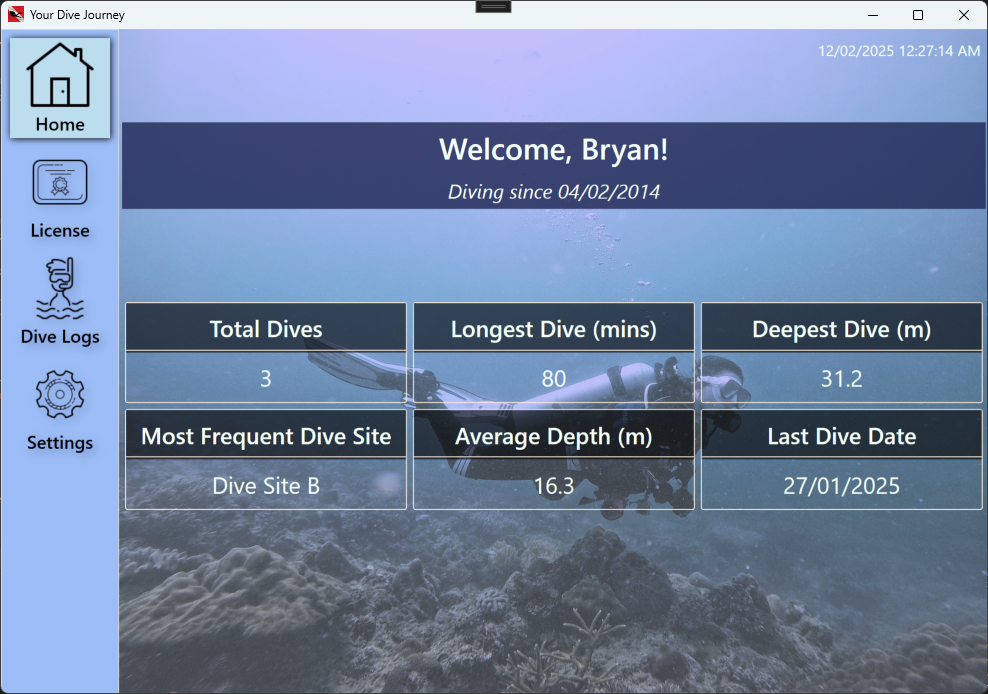
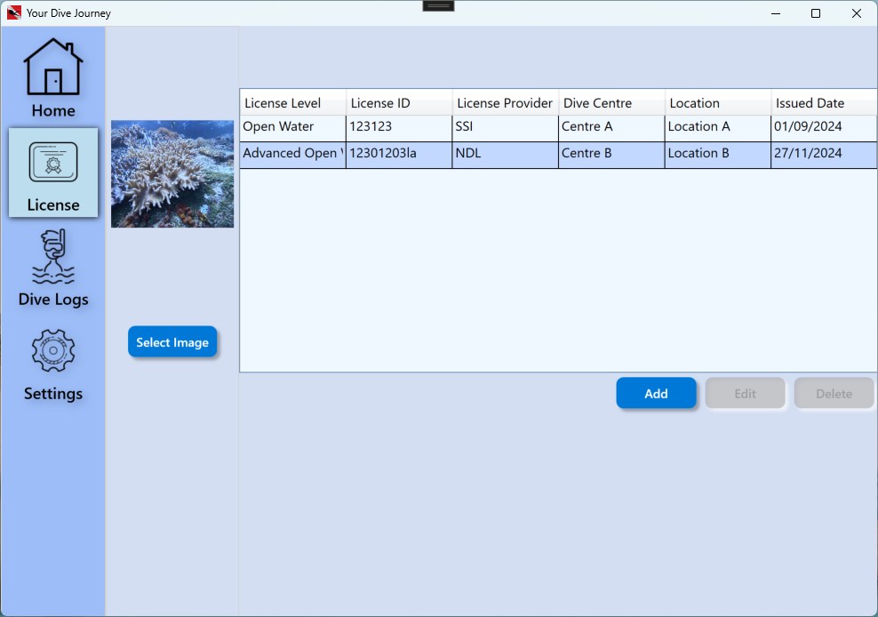
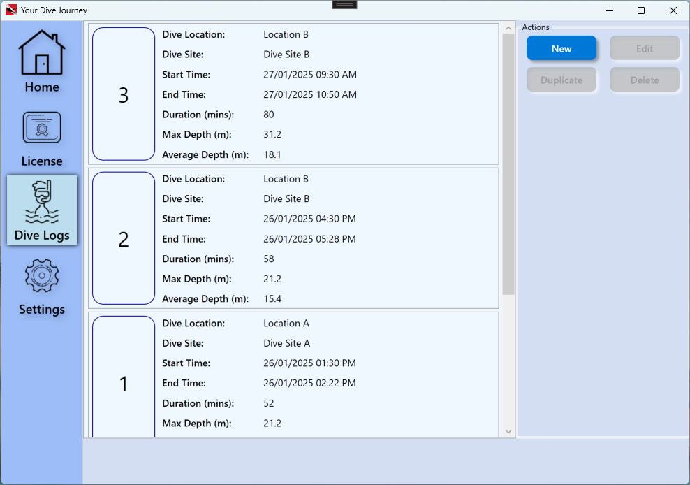
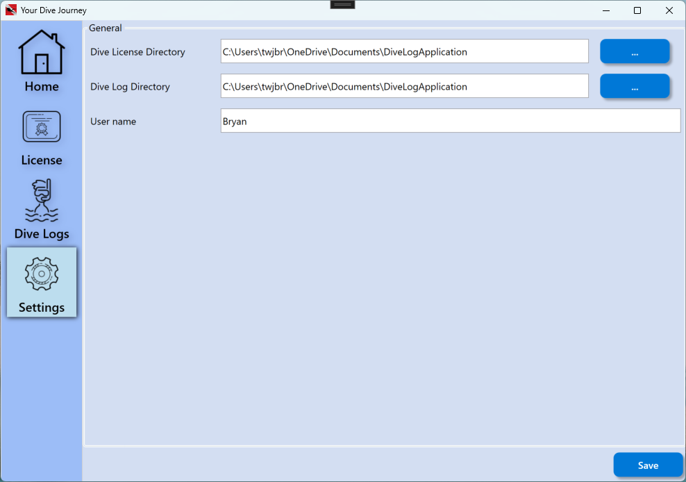

# Your Dive Journey  
*A Windows desktop application for scuba divers to track their dive logs and certifications.*  

## Why Use This App?  
Scuba diving is an incredible experience, but keeping track of all your dives and certifications can be challenging.

**Your Dive Journey** helps divers log their dive history, track certifications, and review dive statistics—all in one place.  

---

## 🖥 Screenshots  
### Homepage  
Displays key dive metrics such as total dives, longest dive, and deepest dive.  
  

### Dive Licenses  
Manage your scuba certifications.  
  

### Dive Logs  
Log and track your diving history.  
  

### Settings  
Customize the app to suit your needs.  
  

---

## 🌊 Features  

### 📊 Homepage  
- View key diving statistics (total dives, longest dive, deepest dive, etc.).  
- Quick navigation to dive logs, licenses, and settings.  

### 🏅 Dive Licenses  
- View all your certifications.  
- Add, edit, and delete certifications.  

### 📖 Dive Logs  
- Log all your dives with details like depth, duration, and location.  
- Edit or delete dive entries.  
- Built-in data validation (e.g., start date must be earlier than end date).  

### ⚙️ Settings  
- Set the location of user data storage.  
- Customize the username displayed on the homepage.  

---

## 🚀 Installation & Usage  
1. **Clone the Repository** 
``` 
git clone https://github.com/yourusername/YourDiveJourney.git  
cd YourDiveJourney  
```
2. **Build the project and run it**
3. **Start Logging Dives!**  

---

## 🛠 Tech Stack  
- **Platform:** Windows (WPF)  
- **Languages:** C#  

---

## 🪲 Found a bug?
Please add an issue, or better yet send a pull request. Thanks!
